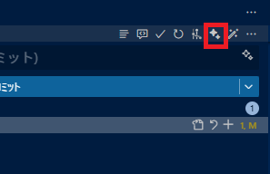

[Japanese README](README.ja.md)

# Commit Message Generator (by Codex)

A VS Code extension that automatically generates a Conventional Commits-style commit message from your repository changes and inserts it into the Source Control input box.  
It can be used in any environment where Codex runs.  
It’s also handy in environments where GitHub Copilot is not available.

## Usage

- From the UI (recommended)
  - A button is added to the Source Control view title bar and near the commit input box. Click it to run “Commit message generation by codex.”
  - It appears when the Git provider is active.  
  
  - While generating, the status bar shows “$(sync~spin) Generating commit message…” and it disappears automatically when finished.  
  
- From the Command Palette
  - Press `Ctrl+Shift+P` and type “Commit message generation by codex”.
  - Or run “Commit message generation by codex” (`commit-message-gene-by-codex.runCodexCmd`) directly.
  - When finished, the generated message is inserted into the commit input box. You can check the execution log in the Output panel “codex exec output”.

## Requirements

- Windows 10/11 with VS Code’s Git extension enabled
- Source Control (SCM) view is open
- Codex CLI installed globally and runnable from `%APPDATA%\npm\codex.cmd` (the helper looks for it there and launches via `cmd.exe`)

## Notes

- Privacy: The extension itself does not send your code externally, but the Codex CLI may send repository context to its provider depending on its settings. Please review Codex’s policies.

## License

MIT License © 2025 komiyamma

