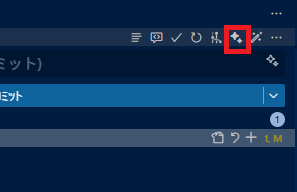
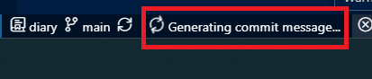

[Japanese README](README.ja.md)

# Commit Message Generator (by Codex)

VS Code extension that automatically generates a Conventional Commits-style commit message from your repository changes and inserts it into the Source Control input box.  
It can be used in any environment where Codex runs.  
It is also intended for use when GitHub Copilot is unavailable, or when using VSCodium-family editors such as Antigravity and AWS Kiro.

The main platform requirements are:

| Platform | Codex CLI requirement | Other requirement |
| --- | --- | --- |
| Windows | No specific version requirement | Logged in to Codex |
| macOS | Codex CLI 0.130.0 or later | Logged in to Codex |
| Linux | Codex CLI 0.130.0 or later | Logged in to Codex |

## Usage

| Method | How to run | Result |
| --- | --- | --- |
| UI (recommended) | Click the button in the Source Control view title bar or near the commit input box. | Runs “Commit message generation by codex.” |
| Command Palette | Press `Ctrl+Shift+P` and type “Commit message generation by codex”. | Runs the command and inserts the generated message into the commit input box. |
| Direct command | Run `commit-message-gene-by-codex.runCodexCmd`. | Runs the same command directly. |

The UI button appears when the Git provider is active.  

Codex analyzes the Git changes and chooses the most appropriate Conventional Commit type, such as `feat`, `fix`, `docs`, or `refactor`. The generated summary follows the `type(scope): subject` format—for example, `feat(extension): add prompt profiles`.

Use **Commit Message Gene: Select Prompt Profile** in the Source Control title bar or Command Palette to choose the built-in English, Japanese, or Korean profile. **Commit Message Gene: Manage Prompt Profiles** lets you add, edit, and delete custom profiles.

While generating, the status bar shows “$(sync~spin) Generating commit message…” and it disappears automatically when finished.  

You can check the execution log in the Output panel “codex exec output”.

## Requirements

| Requirement | Windows | macOS | Linux |
| --- | --- | --- | --- |
| Codex CLI | No specific version requirement | 0.130.0 or later | 0.130.0 or later |
| Codex login | Required | Required | Required |
| VS Code Git extension | Enabled | Enabled | Enabled |
| Source Control (SCM) view | Open | Open | Open |

## Settings

- `Commit Message Gene by Codex: Model`: choose **GPT-5.6 Luna** (default) or **Codex default**. This is a User Setting shared across all workspaces. GPT-5.6 Luna is tried first when selected; if it is unavailable, the extension retries with the model configured in Codex. Codex default leaves the model unspecified from the start and uses Codex’s settings. Changes trigger reconnection automatically.
- `Commit Message Gene by Codex: Message Mode`: choose `summary` for a title only, or `detailed` for a title plus 2-6 concrete code and behavior change bullets.
- `Commit Message Gene by Codex: Prompt Profile`: load the English, Japanese, Korean, or a saved custom profile.
- `Commit Message Gene by Codex: Prompt Text`: the single multiline text area for freely editing the active prompt. Use the profile commands to load, save, edit, or delete custom profiles.

## Notes

- Privacy: The extension itself does not send your code externally, but the Codex CLI may send repository context to its provider depending on its settings. Please review Codex’s policies.

## License

MIT License © 2025-2026 komiyamma

### Prompt migration

On activation, explicit legacy `commitMessageGene.prompt.intro.en/ja` settings are imported into custom profiles and removed only after saving. Generation then uses only the new profile and Prompt Text settings. Existing new settings are preserved. Folder-specific legacy prompts are saved as profiles for manual selection. The Prompt Profile value `auto` follows the UI language; a nonempty Prompt Text overrides the profile. Use the picker to load a profile for editing, then Manage Prompt Profiles to save it.
